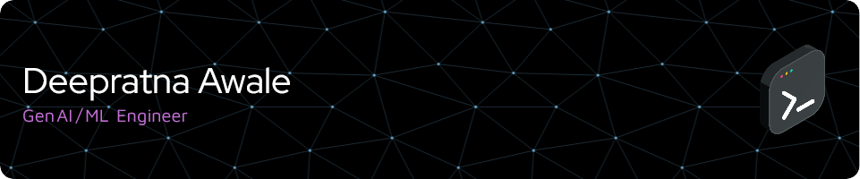

  
  
    
  
  
  

  
   

# 💫 About Me

🔭 I’m currently working on [AutoExpress](https://github.com/deepratna-awale/AutoExpress) 
🤝 I’m looking for help with [EDA-Assist](https://github.com/deepratna-awale/EDA-Assist) 
⚡ Get my resume [here](Resume_Awale_Deepratna.pdf) 
🌱 I’m currently mastering AWS. 
💬 Ask me about LLMs, Diffusion Models, and AGI. 

# 🌐 Socials

| **Connect with me** |
|---------------------|
|    | 

# 💻 Skills

| **Programming Languages** |
|---------------------------|
|      |

| **Domains** |
|-------------|
|    |

| **Frameworks** |
|----------------|
|      |
|      |

| **Libraries** |
|---------------|
|      |
|      |

| **Platforms** |
|---------------|
|     |

| **Tools** |
|-----------|
|     |
|    |

| **Developer Experience** |
|--------------------------|
|     |

# 📊 GitHub Stats

 

## 🏆 GitHub Trophies

## 📄 Research Papers

| **Published Research** |
|------------------------|
| **[Theoretical Answer Evaluation System (T.A.E.S)](https://www.academia.edu/81925526/Theoretical_Answer_Evaluation_System_T_A_E_S_)** - A comprehensive system for evaluating theoretical answers |
| **[Semantic Analysis of Long Answers](https://www.academia.edu/48840919/SEMANTIC_ANALYSIS_OF_LONG_ANSWERS)** - Research on semantic analysis techniques for extended responses |

---

# 💰 You can help me by Donating

| **Support my work** |
|---------------------|
|   | 

